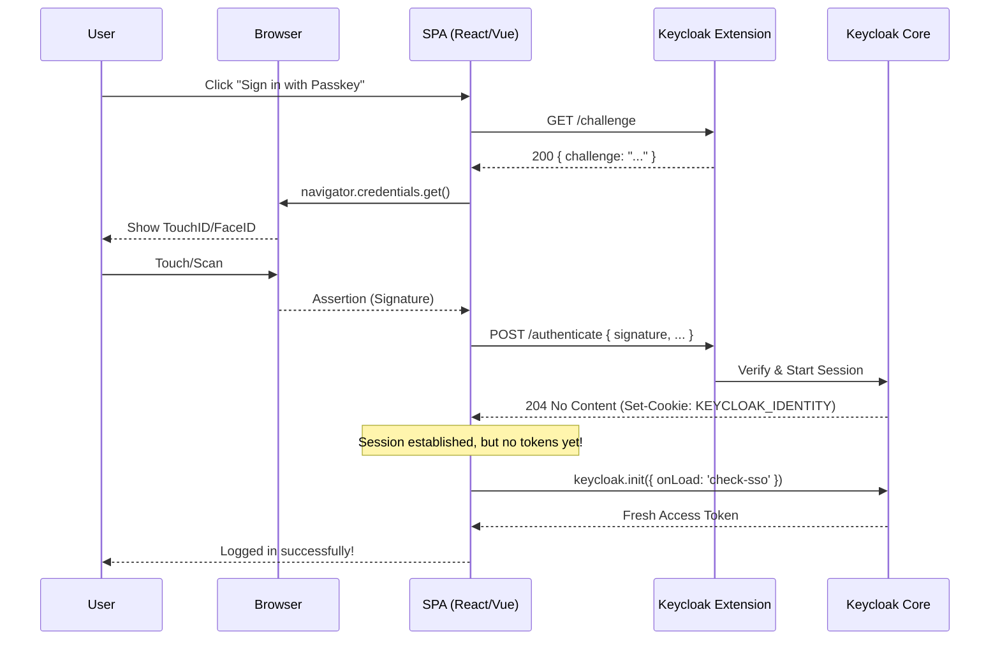

# Keycloak Passkey Extension Integration (Quick Guide)

## Admin (Keycloak) quick summary

To enable this extension, Keycloak admins only need to install the provider and configure realm/client settings:

- Use Keycloak `26.5` or newer.
- Download or build the `custom-passkey-*.jar`, copy it to `keycloak/providers/`, mount `keycloak/providers/` to
  `/opt/keycloak/providers:ro` in Docker if needed, then restart Keycloak.
- In the target realm, configure `Authentication` -> `Policies` -> `WebAuthn Passwordless Policy`: enable passkeys, set
  the Passwordless Relying Party ID, require discoverable credentials, and set user verification to `Required`.
- Ensure each app client that should use passkeys has correct `Web Origins` and `Redirect URIs`, including the silent
  check-sso callback URL.

*Detailed docs:* [Keycloak admin setup](docs/forKeycloakAdmins.md)

## Dev quick summary

After admin setup is complete, app developers integrate the client flow:

- Serve a silent check-sso callback page (for example `/silent-check-sso.html`) and configure
  `silentCheckSsoRedirectUri`.
- Initialize Keycloak with `onLoad: 'check-sso'` (typically with `silentCheckSsoFallback: false`).
- Call `GET /realms/{realm}/passkey/{clientId}/challenge` before registration/authentication.
- Register discoverable passkeys with the Keycloak user id (`tokenParsed.sub`) as WebAuthn `user.id`.
- Register via `POST /realms/{realm}/passkey/{clientId}/save` with `Authorization: Bearer <token>`,
  `credentials: 'include'`, and `credentialId`.
- Authenticate via `POST /realms/{realm}/passkey/{clientId}/authenticate` with `credentials: 'include'`, `credentialId`,
  and `userHandle`, then run `check-sso` again to collect fresh tokens from Keycloak.

*Detailed docs:* [Application developer setup](docs/forApplicationDevs.md)

---

## How to use it?

This extension adds passkey APIs to Keycloak at:

`/realms/{realm}/passkey/*`

New endpoints (required client identification):

- `GET /{clientId}/challenge`
- `POST /{clientId}/save`
- `POST /{clientId}/authenticate`

## How the plugin works

The plugin is a Keycloak `RealmResourceProvider` mounted at `/realms/{realm}/passkey/*`.

1. `GET /{clientId}/challenge` creates a short-lived, single-use challenge in Keycloak server storage.
2. `POST /{clientId}/save` stores in Keycloak a verified passkey for the currently logged-in user (resolved from the
   bearer access token).
3. `POST /{clientId}/authenticate` verifies the WebAuthn assertion (passkey), completes the standard Keycloak browser
   login flow (including required actions), sets the Keycloak login cookie, and returns `204 No Content`.

How `check-sso` uses that session:

- The client calls `/authenticate` with `credentials: 'include'`. After that Keycloak login cookie is stored in the
  browser.
- After successful authentication, run `keycloak.init({ onLoad: 'check-sso' })` again to collect tokens from the new
  cookie-backed browser session (silent mode recommended).
- `check-sso` uses the existing Keycloak browser session (cookie) to silently authenticate and provide fresh tokens in
  `keycloak.token`/`keycloak.tokenParsed` for subsequent API calls.

### Sequence Diagram of login with extension

